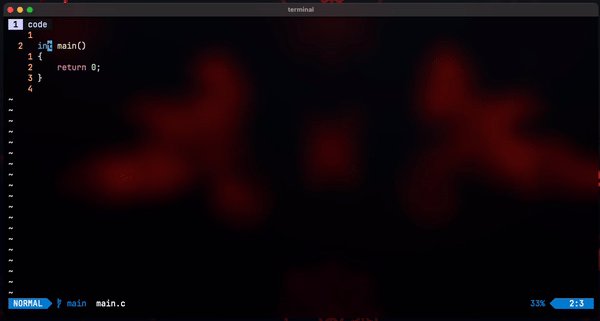

# tmux-compile.nvim

Neovim plugin designed to simplify the process of compiling and running projects
within tmux panes or windows. Supports multiple programming languages by
allowing customisation of build and run commands.



⚠️ [Compatibility Broken](#important-notice-backward-compatibility) ⚠️

## Installation

Install using your favorite plugin manager. For example, using
[lazy.nvim](https://github.com/folke/lazy.nvim):
```lua
{'karshPrime/tmux-compile.nvim', event = 'VeryLazy', config = {
    -- Default configurations which can be overridden in your setup
    overlay_sleep = 1,                 -- Default pause before overlay autocloses
    overlay_width_percent = 80,        -- Default overlay width percentage
    overlay_height_percent = 80,       -- Default overlay height percentage
    build_run_window_title = "build",  -- Default tmux window name for build/run
    build_run_config = {
        {
            extension = {'c', 'cpp', 'h'},
            build = 'make',
            run = 'make run',
        },
        {
            extension = {'rs'},
            build = 'cargo build',
            run = 'cargo run',
        },
        {
            extension = {'go'},
            build = 'go build',
            run = 'go run .',
        }
    }
}},
```

## Keybinds

Create keybindings for any command by adding the following to Neovim config:

```lua
vim.keymap.set('n', 'KEYBIND', 'COMMAND<CR>', {silent=true})
```
Example: to set F5 to compile and run current project in an overlay terminal
window-
```lua
vim.keymap.set('n','<F5>', ':TMUXcompile Run<CR>', {silent=true})
```

### List of all supported commands

| Action / Purpose                                        | Command               |
|---------------------------------------------------------|-----------------------|
| Compile program in an overlay terminal window           | `:TMUXcompile Make`   |
| Compile program in a tmux window                        | `:TMUXcompile MakeBG` |
| Compile program in a new pane next to current nvim pane | `:TMUXcompile MakeV`  |
| Compile program in a new pane bellow current nvim pane  | `:TMUXcompile MakeH`  |
| Run program in an overlay terminal window               | `:TMUXcompile Run`    |
| Run program in a tmux window                            | `:TMUXcompile RunBG`  |
| Run program in a new pane next to current nvim pane     | `:TMUXcompile RunV`   |
| Run program in a new pane bellow current nvim pane      | `:TMUXcompile RunH`   |

\* "Run" here includes both compiling and running the program, depending on the
run command specified for the file type.


## Important Notice: Backward Compatibility
Please note that backward compatibility is broken from Version 1 to Version 2
due to the implementation of a more robust configuration system. In the previous
version, user configuration consisted of a simple list of extensions with their
associated make and run command properties. However, with the introduction of
overlay functionality, it became necessary to add an identifier to this
previously unnamed list, resulting in incompatibility with older configurations.

Apologies for any inconvenience this may cause. From version 2, the plugin has been
designed with future-proofing in mind to ensure that such issues do not recur.

